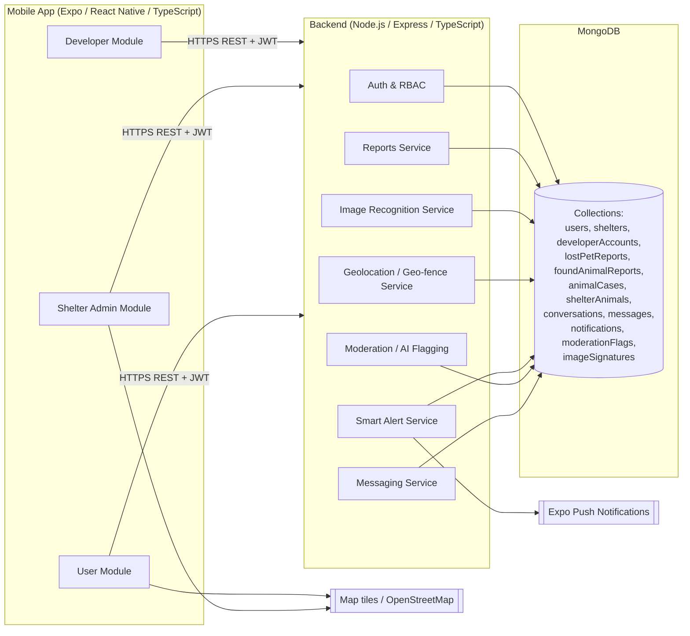

# System Architecture

## Layers

- **Presentation** - React Native screens grouped by module under
  `mobile/src/screens/{developer,shelter,user}`. Navigation is role-gated by
  `AuthContext` -> `RootNavigator`.
- **API** - Express routers under `backend/src/modules/*`. Every route passes
  through `authenticate` + `authorize(role)` and, for anything location-bearing,
  `geoFence` (Limitation #1).
- **Domain services** - `backend/src/services/*` hold cross-module logic
  (image matching, alert fan-out, moderation, geo checks).
- **Data** - Mongoose models in `backend/src/models/*`. MongoDB `2dsphere`
  indexes back all radius / boundary queries.

## Key cross-cutting rules

| Rule | Where enforced |
|------|----------------|
| Service area = San Jose Del Monte only | `backend/src/config/serviceArea.ts` + `geoFence` middleware |
| No RFID/GPS-collar/microchip data | not modeled; identification via `imageSignatures` only |
| No national DB integration | no external gov connectors in `backend/src/services` |
| Smart alerts within selected radius | `smartAlert.service.ts` `$geoWithin` / `$nearSphere` query |
| AI flagging of false reports | `moderation.service.ts`, `moderationFlags` collection |
