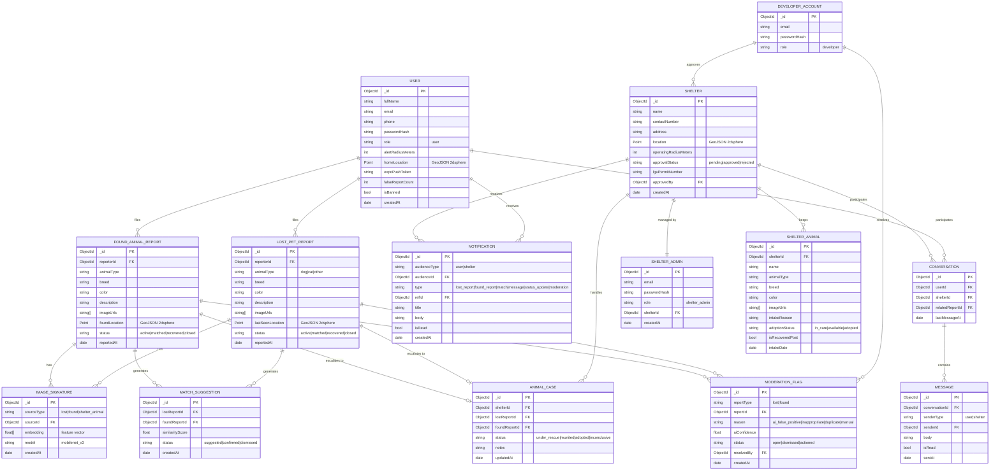

# Entity Relationship Diagram (Figure 30)

```mermaid
erDiagram
    USER ||--o{ LOST_PET_REPORT : files
    USER ||--o{ FOUND_ANIMAL_REPORT : files
    USER ||--o{ NOTIFICATION : receives
    USER ||--o{ CONVERSATION : participates
    DEVELOPER_ACCOUNT ||--o{ MODERATION_FLAG : resolves
    DEVELOPER_ACCOUNT ||--o{ SHELTER : approves
    SHELTER ||--|| SHELTER_ADMIN : "managed by"
    SHELTER ||--o{ SHELTER_ANIMAL : keeps
    SHELTER ||--o{ ANIMAL_CASE : handles
    SHELTER ||--o{ NOTIFICATION : receives
    SHELTER ||--o{ CONVERSATION : participates
    LOST_PET_REPORT ||--o| ANIMAL_CASE : "escalates to"
    FOUND_ANIMAL_REPORT ||--o| ANIMAL_CASE : "escalates to"
    LOST_PET_REPORT ||--o{ IMAGE_SIGNATURE : has
    FOUND_ANIMAL_REPORT ||--o{ IMAGE_SIGNATURE : has
    LOST_PET_REPORT ||--o{ MATCH_SUGGESTION : generates
    FOUND_ANIMAL_REPORT ||--o{ MATCH_SUGGESTION : generates
    LOST_PET_REPORT ||--o{ MODERATION_FLAG : "may raise"
    FOUND_ANIMAL_REPORT ||--o{ MODERATION_FLAG : "may raise"
    CONVERSATION ||--o{ MESSAGE : contains

    USER {
        ObjectId _id PK
        string  fullName
        string  email
        string  phone
        string  passwordHash
        string  role "user"
        int     alertRadiusMeters
        Point   homeLocation "GeoJSON 2dsphere"
        string  expoPushToken
        int     falseReportCount
        bool    isBanned
        date    createdAt
    }
    SHELTER_ADMIN {
        ObjectId _id PK
        string  email
        string  passwordHash
        string  role "shelter_admin"
        ObjectId shelterId FK
        date    createdAt
    }
    DEVELOPER_ACCOUNT {
        ObjectId _id PK
        string  email
        string  passwordHash
        string  role "developer"
    }
    SHELTER {
        ObjectId _id PK
        string  name
        string  contactNumber
        string  address
        Point   location "GeoJSON 2dsphere"
        int     operatingRadiusMeters
        string  approvalStatus "pending|approved|rejected"
        string  lguPermitNumber
        ObjectId approvedBy FK
        date    createdAt
    }
    LOST_PET_REPORT {
        ObjectId _id PK
        ObjectId reporterId FK
        string  animalType "dog|cat|other"
        string  breed
        string  color
        string  description
        string[] imageUrls
        Point   lastSeenLocation "GeoJSON 2dsphere"
        string  status "active|matched|recovered|closed"
        date    reportedAt
    }
    FOUND_ANIMAL_REPORT {
        ObjectId _id PK
        ObjectId reporterId FK
        string  animalType
        string  breed
        string  color
        string  description
        string[] imageUrls
        Point   foundLocation "GeoJSON 2dsphere"
        string  status "active|matched|recovered|closed"
        date    reportedAt
    }
    ANIMAL_CASE {
        ObjectId _id PK
        ObjectId shelterId FK
        ObjectId lostReportId FK
        ObjectId foundReportId FK
        string  status "under_rescue|reunited|adopted|inconclusive"
        string  notes
        date    updatedAt
    }
    SHELTER_ANIMAL {
        ObjectId _id PK
        ObjectId shelterId FK
        string  name
        string  animalType
        string  breed
        string  color
        string[] imageUrls
        string  intakeReason
        string  adoptionStatus "in_care|available|adopted"
        bool    isRecoveredPost
        date    intakeDate
    }
    IMAGE_SIGNATURE {
        ObjectId _id PK
        string  sourceType "lost|found|shelter_animal"
        ObjectId sourceId FK
        float[] embedding "feature vector"
        string  model "mobilenet_v3"
        date    createdAt
    }
    MATCH_SUGGESTION {
        ObjectId _id PK
        ObjectId lostReportId FK
        ObjectId foundReportId FK
        float   similarityScore
        string  status "suggested|confirmed|dismissed"
        date    createdAt
    }
    NOTIFICATION {
        ObjectId _id PK
        string  audienceType "user|shelter"
        ObjectId audienceId FK
        string  type "lost_report|found_report|match|message|status_update|moderation"
        ObjectId refId FK
        string  title
        string  body
        bool    isRead
        date    createdAt
    }
    CONVERSATION {
        ObjectId _id PK
        ObjectId userId FK
        ObjectId shelterId FK
        ObjectId relatedReportId FK
        date    lastMessageAt
    }
    MESSAGE {
        ObjectId _id PK
        ObjectId conversationId FK
        string  senderType "user|shelter"
        ObjectId senderId FK
        string  body
        bool    isRead
        date    sentAt
    }
    MODERATION_FLAG {
        ObjectId _id PK
        string  reportType "lost|found"
        ObjectId reportId FK
        string  reason "ai_false_positive|inappropriate|duplicate|manual"
        float   aiConfidence
        string  status "open|dismissed|actioned"
        ObjectId resolvedBy FK
        date    createdAt
    }
```
