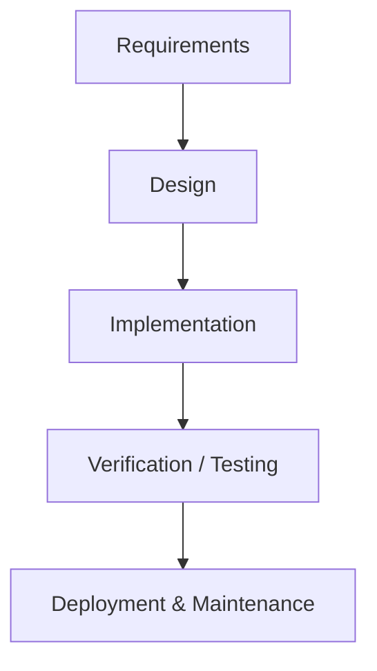

# Methodology - Waterfall Model

The proponents adopted the **Waterfall** software development model for its
straightforward, sequential structure that makes each phase easy to manage,
verify, and document before proceeding to the next.

## 1. Requirements
Gather system requirements for SaanPaw: needs of pet owners, community users, and
local animal shelters collected through surveys (302 respondents), interviews, and
observation. Analyze the existing manual/fragmented reporting process to derive the
functional and non-functional requirements. Output: `docs/scope-traceability.md`,
requirement analysis and documentation sections.

## 2. Design
Define the system architecture, database design (`docs/erd.md`), UI layouts
(`docs/ui-screens.md`), and the behavior of image recognition, geolocation, and
smart notifications. Establish purpose and scope to guide development. Output:
`docs/architecture.md`, `docs/flowcharts.md`, `docs/use-case-diagrams.md`,
`docs/data-flow-diagrams.md`.

## 3. Implementation
Build the mobile application UI (`mobile/`), integrate image recognition, implement
geolocation services, and create the backend (`backend/`) for data storage and
processing. Continuous coding and initial testing per component.

## 4. Verification / Testing
Unit, integration, and system testing (`backend/tests/`, `mobile/__tests__/`).
User Acceptance Testing (UAT) with pet owners and partner shelters to validate
usability and effectiveness.

## 5. Deployment & Maintenance
Publish the mobile application, monitor performance, and perform corrective and
adaptive maintenance based on user feedback.
