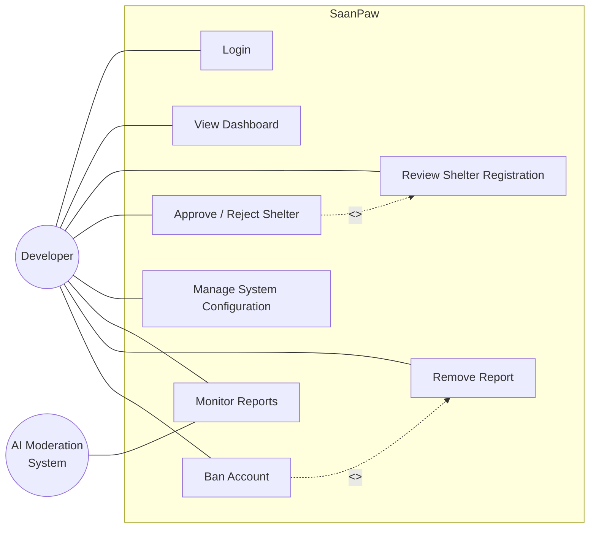
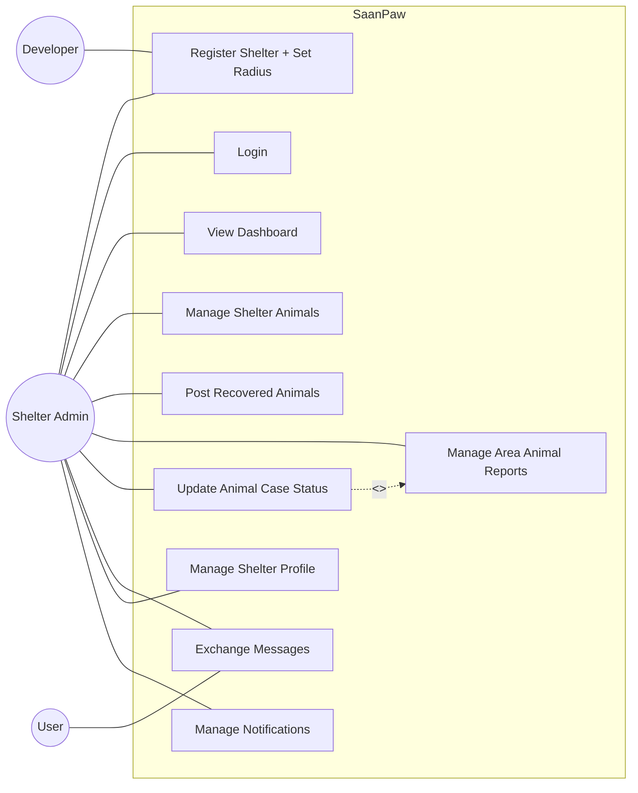
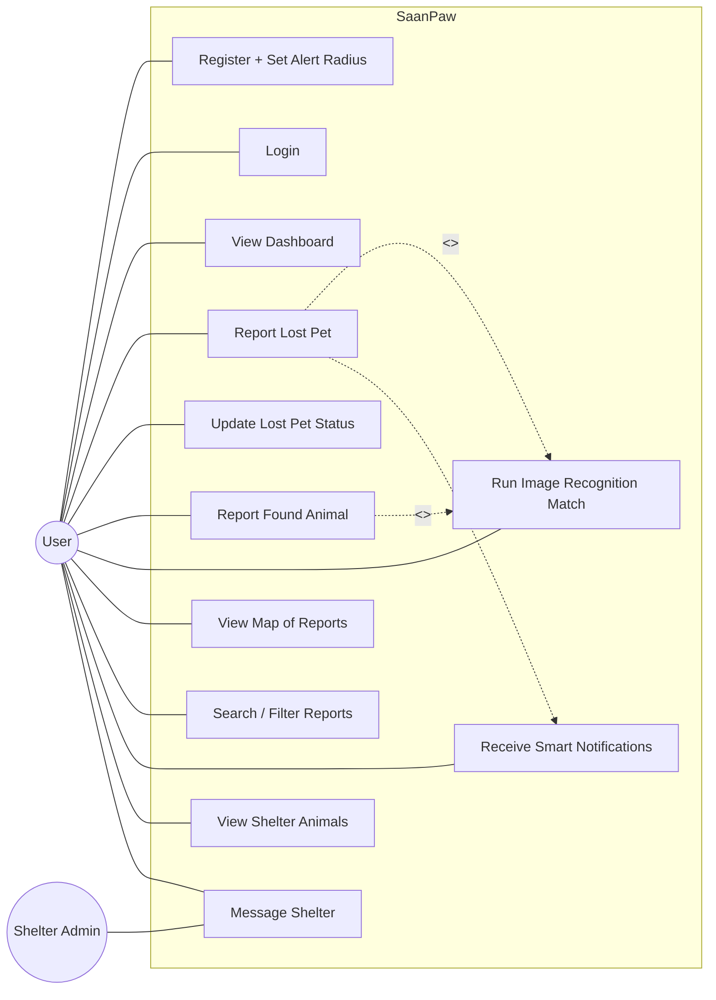

# Use-Case Diagrams (Figures 24-26)

## Figure 24 - Developer Module

```mermaid
flowchart LR
    DEV((Developer))
    AI((AI Moderation\nSystem))
    subgraph SaanPaw
        U1[Login]
        U2[View Dashboard]
        U3[Review Shelter Registration]
        U4[Approve / Reject Shelter]
        U5[Manage System Configuration]
        U6[Monitor Reports]
        U7[Remove Report]
        U8[Ban Account]
    end
    DEV --- U1 & U2 & U3 & U4 & U5 & U6 & U7 & U8
    AI --- U6
    U4 -.->|<<include>>| U3
    U8 -.->|<<extend>>| U7
```

## Figure 25 - Shelter Admin Module

```mermaid
flowchart LR
    SA((Shelter Admin))
    DEVP((Developer))
    USRP((User))
    subgraph SaanPaw
        S1[Register Shelter + Set Radius]
        S2[Login]
        S3[View Dashboard]
        S4[Manage Shelter Animals]
        S5[Post Recovered Animals]
        S6[Manage Area Animal Reports]
        S7[Update Animal Case Status]
        S8[Exchange Messages]
        S9[Manage Shelter Profile]
        S10[Manage Notifications]
    end
    SA --- S1 & S2 & S3 & S4 & S5 & S6 & S7 & S8 & S9 & S10
    DEVP --- S1
    USRP --- S8
    S7 -.->|<<extend>>| S6
```

## Figure 26 - User Module

```mermaid
flowchart LR
    USR((User))
    SHP((Shelter Admin))
    subgraph SaanPaw
        X1[Register + Set Alert Radius]
        X2[Login]
        X3[View Dashboard]
        X4[Report Lost Pet]
        X5[Update Lost Pet Status]
        X6[Report Found Animal]
        X7[Run Image Recognition Match]
        X8[View Map of Reports]
        X9[Search / Filter Reports]
        X10[Receive Smart Notifications]
        X11[View Shelter Animals]
        X12[Message Shelter]
    end
    USR --- X1 & X2 & X3 & X4 & X5 & X6 & X7 & X8 & X9 & X10 & X11 & X12
    SHP --- X12
    X4 -.->|<<include>>| X7
    X6 -.->|<<include>>| X7
    X4 -.->|<<include>>| X10
```
